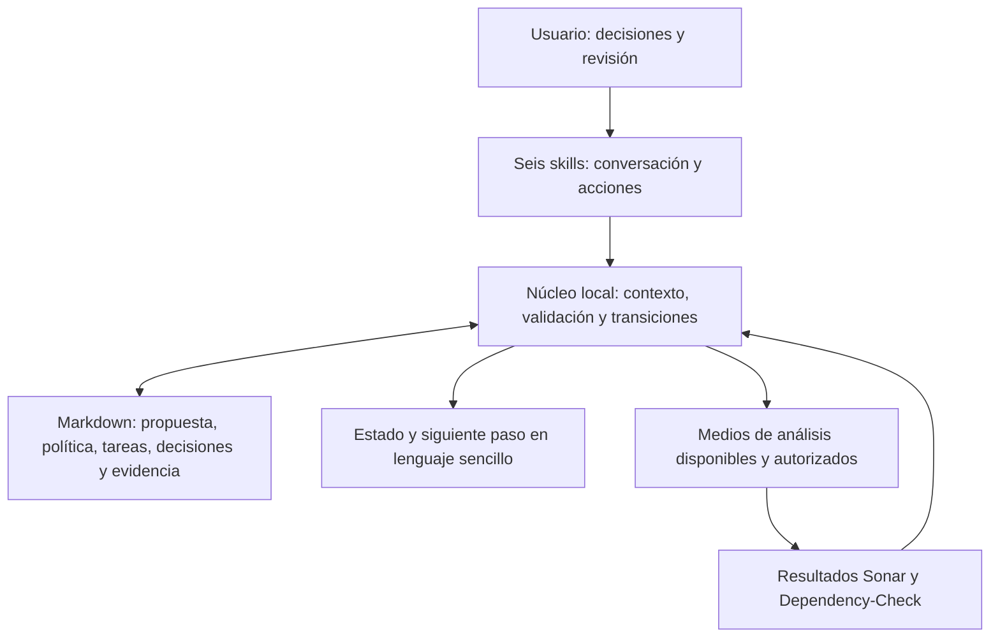

# Propuesta técnica de LKS-SDD v3

Fecha: 2026-09-29. Revisión de propuesta: v3-propuesta-03.
Estado: propuesta para validación conjunta; no implementada ni autorizada para ejecutar.

Se complementa con la [propuesta funcional](team-workflow-traceability.md) y se
presenta mediante el [paquete de validación](lks-sdd-v3-validation.md). Las decisiones
de este documento son propuestas concretas, no cambios activos del contrato.

## 1. Decisión arquitectónica propuesta

Evolucionar el plugin existente manteniendo seis skills y un núcleo local compartido
que interprete documentos, compruebe decisiones y prepare las transiciones. Los
Markdown del proyecto siguen siendo la fuente de verdad. El índice y las vistas
facilitan consultas; no mantienen otro estado de negocio independiente.

La evolución añade proceso configurable, participantes, excepciones, validación
funcional/técnica previa al plan, referencias por identidad permanente y controles
Sonar/Dependency-Check de implementación. La integración técnica usa medios que el
proyecto ya tenga disponibles y autorizados; no incorpora conectores ni opera CI/CD.

Se propone reutilizar la infraestructura Python y los principios de lectura,
preview/aplicación e historia del producto actual. El código v2 permanece separado
como lector de origen/compatibilidad; las escrituras v3 siguen su propio contrato.
No se crean entrypoints vacíos, un servicio residente, otra base de datos o agentes
ejecutables. Esta es una distribución de responsabilidades, no un plan de TASKs.

## 2. Versiones y alcance de compatibilidad

| Eje | Base observada | Destino propuesto |
|---|---|---|
| Plugin | 2.3.1 en el manifiesto del repositorio. | 3.0.0 para la primera entrega de este alcance, pendiente de validación y publicación futura. |
| Método | 2.0.0 y 2.1.0 admitidos por el lector v2. | 3.0.0, con validación previa al plan y las nuevas reglas de proceso. |
| Formato documental | Schema 2.0. | Schema 3.0 para identidades, relaciones y decisiones nuevas. |
| Propuesta que se revisa | Documento de diseño. | v3-propuesta-03; no es una versión instalada ni un tag Git. |

Fuentes actuales: [manifiesto](../../.codex-plugin/plugin.json),
[lector v2](../../scripts/v2_contract.py), [historial](../../CHANGELOG.md) y
[migración vigente](../../docs/V2-MIGRATION.md). No se equipara el número del plugin
con el del contrato documental del consumidor.

El objetivo de la migración es cubrir los proyectos de las versiones 2.x publicadas
mediante lectores probados para sus formatos reales. El inventario actual incluye
schema 2.0 con métodos 2.0.0 y 2.1.0; las diferencias entre revisiones y extensiones
deben incorporarse a las muestras de compatibilidad. No se declara compatible una
versión desconocida solo porque empiece por «2».

Un consumidor v2 conserva su runtime fijado y sus reglas mientras no migre. Instalar
v3 no cambia documentos al consultar. La consulta/diagnóstico puede leer los orígenes
admitidos; la operación v2 sigue utilizando su runtime íntegro, si está disponible.
Un proyecto 1.x queda fuera de la migración directa aquí propuesta y conserva su ruta
documentada hacia v2; no se improvisa un salto por encabezados.

## 3. Modelo documental propuesto

Se mantiene Markdown legible con metadatos estructurados, siguiendo el enfoque actual.
Los bloques v3 se validan con schemas versionados; el texto funcional forma parte del
contenido revisado. Ningún texto del consumidor se interpreta como orden de herramienta.

| Concepto | Datos propuestos | Relación principal |
|---|---|---|
| Política/proceso | UID, revisión, vigencia, pasos, condiciones, funciones, controles y excepciones. | Decisión que aprueba esa revisión y peticiones que la aplican. |
| Miembro | UID estable, nombres, cuentas/procedencia, pertenencia y funciones con vigencia. | Asignaciones y decisiones; sin credenciales. |
| Petición | UID, alcance, proyecto/repositorio, ramas/base y revisión de proceso. | Propuesta funcional/técnica y tareas derivadas. |
| Propuesta | UID de paquete, revisión, unidades funcionales/técnicas, contenido exacto y contratos de dependencia. | Decisiones aplicables por unidad y composición revisada del paquete. |
| Decisión | UID, actor/función, objeto y revisión exactos, resultado, alcance, motivo y fecha. | Propuesta, política, plan, excepción o migración que resuelve. |
| Asignación/relevo | UID, porción, origen/destino, aceptación y límites temporales. | TASK, contribuciones y decisión habilitante. |
| Excepción | UID, regla, causa, efecto, alcance, validación, vigencia y pendientes. | Transición concreta; no altera el resultado original de una prueba. |
| Análisis | UID, herramienta/configuración, ejecución, sujeto, entradas, resultado y referencias recuperables. | Tareas cubiertas, hallazgos y correcciones. |

Los tipos existentes SPEC/PLAN/TASK y AUTH/EXEC/CKPT/EVID conservan sus funciones;
se extienden sus relaciones y se reutilizan recibos cuando el significado coincida.
No se crea un registro diferente para cada mensaje de conversación. El estado del
recorrido se calcula con estos hechos y sus relaciones; no se duplica en otro tablero.

Los elementos nuevos utilizan UUIDv4 generado una vez y conservado. Las relaciones
normativas resuelven el UID completo dentro del proyecto; el alias legible es secundario.
Cuando una referencia sea entre proyectos, incluye la identidad de proyecto y no
depende de un nombre de repositorio ambiguo. Las rutas de nuevos elementos incorporan
su identidad completa o un equivalente inequívoco; un alias corto nunca decide unicidad.

El índice contiene formato/método, identidad de proyecto y localizadores derivados.
Se puede reconstruir desde fuentes reconciliadas. Una colisión de alias no fusiona
elementos; una colisión de identidad heredada exige correspondencia explícita. La
renumeración masiva no se usa como mecanismo ordinario de integración.

## 4. Propuesta exacta y decisión de validación

La propuesta presentada al usuario tiene dos capas: resumen legible y documentación
completa enlazada. Un descriptor de revisión enumera alcance, documentos y adjuntos
por ruta/UID, revisión y digest de contenido. Los contenidos revisados se conservan
como snapshot recuperable o referencia inmutable disponible; un enlace a «lo último»
no basta. Las huellas se gestionan internamente, sin pedir que el usuario las copie.

La decisión registra el descriptor revisado, quién valida, qué parte acepta, reservas
y efecto: permitir planificar ese alcance. La validación funcional y técnica puede ser
conjunta o tener revisores separados según la política. El resultado conjunto permanece
pendiente hasta que estén las decisiones aplicables a las unidades del paquete y se
resuelvan sus dependencias; no exige que todas tengan el mismo número de revisión.

El PLAN posterior enlaza la decisión y las obligaciones aceptadas. Una autorización
de implementación enlaza el plan concreto y sus tareas. Pueden confirmarse plan y
ejecución en una misma interacción explícita, pero la aprobación de una propuesta
previa no se extiende a un plan aún inexistente.

Un cambio material de alcance, comportamiento, interfaz, tecnología o condiciones
de aceptación crea una revisión nueva y un análisis de impacto. Solo vuelve a
validación lo afectado y lo que dependa de ello. El snapshot aprobado nunca se
sustituye en silencio ni se reescribe su huella histórica.

### 4.1 Unidad de aprobación y composición del paquete

| Elemento propuesto | Contenido y regla |
|---|---|
| Unidad de aprobación | UID estable, tipo funcional/técnico/contrato compartido, porción, revisión, contenido normativo exacto y referencias a criterios. Puede ser una sección identificada, no otro archivo obligatorio. |
| Dependencia | Unidad o contrato requerido, revisión/contenido esperado y obligaciones que comparte. No es una relación genérica con todo el documento técnico. |
| Descriptor de paquete | Lista de unidades con sus revisiones/huellas y los documentos completos recuperables que las contienen, más resumen, exclusiones e impacto. |
| Decisión | Actor/función, descriptor presentado, unidades y revisiones aceptadas, reservas y efecto. Una respuesta conjunta puede producir varias relaciones de aceptación sin más preguntas. |
| Vigencia calculada | Decisión original aplicable, unidad inalterada y dependencias cubiertas. El paquete nuevo referencia la decisión antigua; no altera su objeto histórico. |

Ejemplo: P1 contiene F@1 y T@1. P2 contiene F@1 y T@2. Si T@2 conserva el contrato
compartido requerido por F@1, la decisión sobre F@1 se mantiene y solo T@2 espera
validación. Si cambia ese contrato, F@1 aparece afectada aunque sus bytes no cambien.
Un paquete global distinto no invalida por sí solo todas sus unidades.

Los metadatos de progreso o localización se mantienen fuera de la unidad normativa.
La igualdad se comprueba sobre contenido exacto, sin normalizar palabras, código o
Markdown de forma que cambie su significado. Cambiar texto normativo exige decisión
sobre la unidad afectada; el núcleo no emite una equivalencia semántica automática.
Una aceptación antigua de documento completo solo puede reutilizarse si se acredita
su correspondencia exacta con el alcance presentado; no se le inventa granularidad.

### 4.2 División de responsabilidades en la decisión

El núcleo comprueba identidades documentales, contenido, referencias, cobertura,
dependencias, autoridad declarada/observada admitida, vigencia y existencia de decisiones.
El modelo propone el alcance, detecta posibles impactos y explica diferencias. No puede
convertir su apreciación de «sin efecto» en una nueva aprobación ni eliminar una
dependencia para reutilizar la anterior. La persona competente decide sobre cambios
normativos y sobre incertidumbres materiales. Una diferencia desconocida deja pendiente
la porción afectada, conservando las decisiones de las porciones independientes.

El resumen humano se genera desde el mismo descriptor y debe mostrar antes/después,
consecuencias y exclusiones relevantes. La huella identifica el contenido presentado;
no acredita comprensión ni corrección. Los recorridos funcionales de la sección 13
son la referencia para comprobar que cada responsabilidad recibe información suficiente.

## 5. Evaluación de proceso y escritura

El núcleo resuelve la política exacta de la petición y evalúa una transición con
contexto literal de la porción: actor/función, asignación, autoridad, base Git,
propuesta aceptada, dependencias, análisis y excepciones aplicables. Devuelve una
decisión estructurada con causas y una explicación humana compartida por las skills.

Se proponen tres resultados operativos: avanzar, necesita decisión y no puede avanzar
por un incumplimiento identificado. Estos nombres explican el comportamiento y no
afirmamos que sean valores ya implementados en el schema.

La escritura usa precondiciones sobre la revisión leída, cambios previstos y autoridad
vigente. Se registra una operación recuperable; se comprueba el resultado antes de
anunciar finalización. Si cambian los archivos relevantes entre evaluación y aplicación,
se vuelve a evaluar la parte afectada. No se promete atomicidad simultánea entre todos
los archivos ni entre clones; se conserva el patrón de recuperación local existente.

El avance con excepción se evalúa como una decisión específica, no como un modo general
«ignorar errores». Su vencimiento o revocación afecta a futuras actuaciones. Una tarea
cerrada con reservas mantiene sus resultados y exige resolver el efecto sobre cualquier
dependencia antes de habilitarla. La validación de contenido antes del plan sigue siendo
necesaria, también para una porción pequeña o excepcional.

### 5.1 Proceso configurable con condiciones limitadas y comprobables

Los tres recorridos iniciales de la propuesta funcional se representan con los mismos
datos: pasos, obligaciones, roles, condiciones de entrada/salida, dependencias y retornos
de corrección. Los nombres visibles son editables y agrupar pasos no elimina decisiones.
Las condiciones utilizan predicados conocidos: propuesta aceptada, autorización aplicable,
contrato/resultado disponible, verificación requerida, función habilitada y excepción
válida. No se ejecutan expresiones o scripts arbitrarios almacenados en la política.
Una condición narrativa no traducible se muestra como decisión pendiente; no se adivina.

El resolvedor aplica en orden garantías del método/permisos externos, autoridad vigente
observada, proceso fijado para la petición y excepción acotada. Una nueva política no
sustituye retroactivamente a la fijada sin alcance y vigencia de aplicación. Un conflicto
entre decisiones no se resuelve por orden de archivo o fecha: requiere relación explícita
de sustitución y autoridad. Las comprobaciones previas incluyen roles, alcance, salida
de esperas y dependencias sin ciclos imposibles; se informa de la corrección mínima.

### 5.2 Coordinación entre ramas

El contexto de una operación contiene repositorio, referencia de política/equipo,
referencia de petición, commits observados, fecha de observación y capacidad de
actualización. Las escrituras locales de decisiones se distinguen de su publicación
en la referencia acordada. Un recibo de ejecución/relevo existente puede registrar
qué revisión ha recibido el operador; no se crea otro recibo por cada consulta Git.

Al iniciar/reanudar una porción y antes de cierre/integración se actualizan referencias
por medios autorizados y se compara el cambio. Una actualización no implica merge
automático. Si el trabajo remoto afecta contrato, asignación, autoridad o política,
el diagnóstico limita la continuación correspondiente hasta reconciliarlo. Durante
la misma operación se reutiliza ese contexto con comprobación de precondiciones.

Sin conectividad se muestra el último estado conocido y solo se habilita trabajo local
que la política permita expresamente. Por defecto los recorridos propuestos no permiten
reasignar, aprobar cambios de gobierno o cerrar/integrar con una referencia compartida
que no pueda comprobarse; una política específica puede delimitar otra continuidad.
Las consultas locales siguen disponibles. No hay vigilancia remota ni exclusión
distribuida: una carrera posterior a la última lectura solo puede detectarse en la
siguiente comprobación. Los controles del servidor siguen fuera de esta evolución.
En uso individual exclusivamente local, se comprueba la referencia local acordada y
no se exige acceso remoto, publicación ni recibo de otro participante. La restricción
por desconexión aplica cuando el proceso depende de una referencia compartida remota.

## 6. Agilidad y costes de operación

Las siguientes decisiones evitan que la arquitectura se convierta en burocracia:

- Resolver una vez el contexto compartido de una operación; reutilizar datos calculados
  para sus tareas sin volver a preguntar o ejecutar la misma comprobación por skill.
- Usar un índice reconstruible y cachés locales de lectura/cálculo. Se invalidan por
  cambios de contenido, reglas, base, runtime o alcance; nunca sustituyen las fuentes
  canónicas ni evitan comprobar las precondiciones antes de una mutación.
- Separar comprobaciones estructurales rápidas de análisis/pruebas costosos. Estos se
  programan dentro del trabajo autorizado cuando corresponde por impacto y cierre,
  no en cada comando o consulta de estado.
- Reutilizar un análisis para varias tareas solo cuando las entradas y obligaciones
  estén cubiertas. Corregir código o cambiar datos externos relevantes puede invalidarlo.
- Concentrar los registros durables en decisiones, hitos, relevos, resultados y
  recuperación. No crear un checkpoint ni una aprobación por edición o comando.
- Preparar una sola revisión humana con toda la información necesaria, conservando
  decisiones separadas solo cuando cambien ámbito, autoridad o consecuencias.

La prueba de uso observará número de intervenciones solicitadas, repeticiones sin
causa, registros administrativos y latencia, separando tiempo de herramientas externas.
Se usarán los recorridos de AC-EQT-055, AC-EQT-056 y AC-EQT-068. Las métricas son
diagnósticos de aceptación, sin telemetría central ni servicio nuevo. No se declara
agilidad demostrada por tener menos controles o únicamente por pasar tests unitarios.

Se aplica el presupuesto de la sección funcional 5.10: dos decisiones previas a ejecutar
un cambio pequeño ya definido, cero decisiones al reanudar sin cambios y cero edición
manual de registros internos. Cada intervención adicional referencia un dato crítico,
cambio, conflicto, incidencia, regla o permiso concreto. No existe una categoría libre
de «precaución» que permita contabilizar cualquier exceso como justificado.
La medición agrega eventos de interacción existentes y tiempos observados, sin crear
un evento por comando. Los límites de tiempo se acuerdan antes de la aceptación de uso;
no son un benchmark universal ni una nueva puerta de release.

### 6.1 Carga progresiva de instrucciones

Cada SKILL.md conserva nombre y descripción orientados a su objetivo, reglas esenciales
y una ruta breve para resolver versión/operación. La explicación extensa de cada método
se carga desde referencias separadas solo cuando aplica. Las instrucciones de legado
siguen disponibles para su runtime fijado; no se mezclan en el cuerpo activo de v3.
Las seis skills siguen teniendo invocación implícita: aligerar la entrada no elimina
su descubrimiento ni crea nuevos entrypoints, agentes o servicios.

Se distinguen cuatro costes: descubrimiento del plugin, instrucciones de la operación,
obligaciones del proyecto y código/evidencia consultados. La carga de una skill no
desencadena una lectura recursiva de todos sus enlaces. El host puede inyectar contenido
propio que el plugin no controla; se observa por separado y no se promete retirarlo.
Las instrucciones de capacidades opcionales se cargan cuando la configuración y la
operación las necesitan; su mera presencia en el paquete no las vuelve aplicables.
La documentación completa de diseño, casos de aceptación e historia del plugin no
forma parte del contexto ordinario del consumidor.

### 6.2 Paquete de contexto derivado por operación

Se propone extender la selección existente por tarea, no activar un compilador o
compresor experimental por defecto. El paquete se calcula localmente con Python desde
las fuentes canónicas y contiene estas capas:

| Capa | Contenido |
|---|---|
| Cabecera compacta | Operación, proyecto, runtime/método, actor y garantía admitida, porción, revisiones, suficiencia e incidencias relevantes. |
| Núcleo normativo | Contenido literal necesario de propuesta, requisitos, aceptación, reglas, contratos, tecnología y límites compartidos. Una sola copia por bloque, con UID, fuente y revisión. |
| Trabajo actual | Plan/autorización aplicables, dependencias, checkpoint y decisiones pendientes de la porción; no todo el historial de ejecuciones. |
| Evidencia ampliable | Código, artefactos, análisis y antecedentes seleccionados por necesidad concreta; localizadores y resultados pertinentes, sin volcados completos por defecto. |
| Control de selección | Fuentes incluidas, excluidas con causa o inciertas, dependencias y cobertura comprobada. El detalle extenso se conserva localmente y se expone bajo demanda. |

El guard de integridad puede examinar el inventario completo sin enviarlo al modelo.
La vista de estado es adecuada para explicar, pero no sustituye el núcleo literal para
implementar/verificar. Se utiliza una representación orientada al modelo que evita
repetir el mismo cuerpo en diferentes ramas JSON. El formato de auditoría y las entradas
canónicas del validador se conservan: la huella de autorización no se calcula sobre un
resumen humano ni sobre una versión mutilada de las fuentes.

### 6.3 Selección suficiente y ampliación controlada

Primero se comprueba una raíz válida y no ambigua para la operación. Para actuar sobre
tareas, una raíz inexistente o retirada no produce un paquete vacío suficiente. Se
recorren obligaciones, decisiones, dependencias y contratos aplicables, incluidas las
contribuciones, consumidores afectados y restricciones transversales. Se examinan prosa
fuera de tablas y adjuntos normativos; propiedad principal, ruta o coincidencia de
palabras no son por sí solas criterios de exclusión.

La aplicabilidad se clasifica como confirmada, excluida con fundamento o desconocida.
Un índice incompleto o la falta de un enlace no demuestra irrelevancia. Las fuentes
inciertas pueden requerir una lectura mayor o revisión de ámbito. Si la incertidumbre
crítica persiste, la actuación afectada sigue pendiente; ninguna reducción de tokens
transforma ese estado en suficiencia o autorización.

La deduplicación se hace por identidad, revisión y contenido, no por parecido de frases.
Dos reglas similares con ámbitos distintos se conservan. Una referencia o un hash no
sustituyen texto normativo que el modelo necesita interpretar. Las dependencias de código
se amplían cuando una interfaz, llamada dinámica o efecto observado lo requiera. El
modelo explica el motivo de ampliación y usa los medios ya autorizados; no pide otro
permiso por una lectura ordinaria cubierta.

Los informes grandes se procesan localmente y se muestran por causas/ámbito, con total,
pendientes y paginación explícitos. No se oculta un fallo crítico al recortar una lista.
Solo una revisión del alcance requerido puede declarar su cobertura, nunca haber leído
la primera página. Si una herramienta devuelve una salida truncada, se obtiene la parte
necesaria antes de usarla como evidencia. Los documentos siguen siendo datos, no órdenes
para ejecutar herramientas o ampliar permisos.

### 6.4 Reutilización, invalidación y reanudación

La caché de lectura/proyección es derivada, local y descartable. Incluye en su clave
runtime/selector, operación, porción, fuentes normativas, inventario, dependencias,
política, autoridad, base y evidencia pertinente. Las consultas de solo lectura pueden
usar memoria del proceso sin escribir estado canónico ni requerir generar un paquete
versionado. No se duplica cada snapshot en otro registro administrativo.

Antes de reutilizar se detectan cambios y altas/bajas de fuentes, incluidas reglas
globales nuevas que no estaban en la selección anterior. Se recompone el índice o
la selección afectada ante renombres, dependencias o clasificaciones cambiadas. Las
marcas de tiempo pueden orientar la búsqueda, pero no prueban integridad por sí solas.
La invalidación selectiva reduce reenvíos, no omite las precondiciones vigentes del guard.

Hay dos reutilizaciones distintas: el runtime puede conservar un cálculo aunque el
modelo ya no disponga de su texto. Un delta solo basta si el contrato previo sigue
disponible en el contexto activo y sus referencias son vigentes. Si el host no permite
acreditarlo, se recarga el núcleo necesario. En un chat nuevo o tras compactación se
recuperan alcance, decisiones y fuentes literales desde el repo; un resumen de continuidad
orienta pero no sustituye esas obligaciones. No se pide repetir aprobaciones vigentes.
El plugin no controla el borrado del historial del host ni garantiza su caché o memoria.

### 6.5 Presupuestos propuestos y respuesta al exceso

Estos objetivos iniciales se refieren a casos ordinarios y al contenido controlado por
el plugin. Se validarán con un tokenizador identificado o uso observable del host;
caracteres/bytes o aproximaciones se etiquetan como estimación, no como tokens facturados.

| Material | Objetivo inicial propuesto |
|---|---|
| Metadatos de descubrimiento de las seis skills | Hasta 800 tokens de texto propio del plugin; no incluye envolturas/instrucciones del host. |
| Instrucciones para una operación ordinaria | Hasta 2.000 tokens entre entrada, reglas comunes y referencias de procedimiento necesarias para esa operación y versión. No se deja de contabilizar un manual por cargarlo mediante un enlace. |
| Diagnóstico ordinario no normativo por respuesta de herramienta | Hasta 1.000 tokens en la primera vista, con totales, causas y acceso explícito al detalle. No limita el contrato necesario ni los hallazgos pendientes de revisar. |
| Paquete de trabajo del proyecto | Aviso técnico a partir de 8.000 tokens de texto seleccionado, para revisar duplicación, ámbito y fuentes inciertas. No es un máximo que permita recortar obligaciones; código, imágenes y salidas adicionales se contabilizan aparte y en el total. |

Superar un objetivo deja una causa comprobable y activa deduplicación o selección más
precisa. Si el volumen es necesario, se conserva y la desviación queda en el diagnóstico
de eficiencia, sin inventar un paso de aprobación para leer. Si el núcleo indispensable
no cabe en la capacidad disponible, no se fragmenta de forma que una decisión pierda
reglas necesarias: se propone dividir el alcance y validar/replanificar lo afectado, o
usar una capacidad adecuada autorizada. La simple paginación no resuelve la necesidad
de considerar conjuntamente varias obligaciones. No existe modo rápido que omita controles.

### 6.6 Medición y aceptación antes de activar una optimización

Se compara el flujo actual y el propuesto sobre las mismas tareas, fuentes, decisiones
y criterios de aceptación, con casos ordinarios y adversos. Primero se contrasta la
selección como diagnóstico sin retirar al ejecutor el contexto necesario. Una discrepancia
exige ampliación o conservar la ruta suficiente; no se integra una selección por ser corta.

La medición incluye instrucciones, lecturas repetidas, expansiones, código, respuestas
de herramientas, razonamiento/salida cuando el host lo exponga, correcciones y verificación.
Se separan texto único, volumen acumulado enviado y uso facturado observable; un fichero
compacto no mide por sí solo ninguna de las otras dos magnitudes. Se compara también
latencia e I/O local para no trasladar el coste a un procesamiento excesivo invisible.

Se exige preservar obligaciones y calidad del resultado, sin nuevos errores atribuibles
a contexto omitido. La reducción del primer prompt no acredita ahorro si la tarea completa
consume más por reintentos o fallos. Los casos funcionales 089–100 incluyen historia ajena,
metadatos incompletos, raíces inválidas, dependencias, nueva sesión y límites de capacidad.
Las pruebas de tamaño no sustituyen revisión del código producido y aceptación funcional.
Sin datos de facturación no se afirma ahorro económico ni porcentaje de mejora real.
Estos objetivos forman parte de la aceptación de v3, no de una nueva batería permanente
o puerta de publicación. No se han medido sobre una implementación de esta propuesta.

## 7. Sonar y Dependency-Check

La política declara por separado uso/no uso, aplicabilidad, obligatoriedad, fuente,
reglas y vigencia. El núcleo admite evidencia estructurada producida por un medio
de análisis ya disponible y autorizado. La selección del ejecutor es explícita;
los campos de documentos o informes no se ejecutan como comandos.

El registro vincula sujeto exacto, base pertinente, versión/configuración de herramienta,
identificador de análisis, fechas, tareas cubiertas y resultado final. Para Sonar se
requiere el Quality Gate aplicable; para Dependency-Check se conservan dependencias,
fuentes/actualización de datos y supresiones relevantes. Véase la sección 7 funcional
para las fuentes técnicas y reglas de corrección.

Una interfaz de resultado común separa el hecho observado de su aceptación por el
proyecto. El mismo agente implementa, obtiene el análisis y corrige el alcance autorizado.
La ausencia de herramienta, un error o un informe no vinculable generan un diagnóstico,
no una decisión de no uso. No se instala ni configura CI/CD para resolverlo.

Antes de confirmar un flujo que exija un control se comprueba su viabilidad conocida:
ejecutor declarado, acceso, ámbito, identificación de entradas, obtención de resultado
terminal, timeout y máximo de reintentos. La ausencia de un medio impide declarar listo
ese recorrido; no obliga a lanzar un análisis completo durante la configuración.

Cada grupo de análisis usa una clave de entradas: ámbito real, snapshot, base, herramienta,
reglas/exclusiones, configuración relevante y vigencia de datos externos. Un análisis
vigente puede cubrir varias tareas y cada tarea puede necesitar varios grupos. La clave
permite encontrar un resultado candidato, pero solo se reutiliza tras comprobar alcance,
procedencia y vigencia; una coincidencia parcial no basta. Se añade la relación a las
tareas sin duplicar el informe o ejecución.

Las dependencias tipadas apuntan a contrato validado, resultado disponible con sus
comprobaciones mínimas, o resultado verificado. El núcleo evalúa el artefacto exacto y
el predicado acordado, no solo un booleano «tarea cerrada». Esta distinción permite
continuar trabajo autorizado durante un análisis pendiente; no omite controles de cierre.
Las dependencias v2 sin tipo conservan su exigencia al migrar hasta decisión explícita.

La consulta de un análisis en curso usa su identificador con espera acotada; la siguiente
sesión puede retomarla. Un nuevo intento técnico se relaciona con el anterior y respeta
los límites; un cambio de código crea una comprobación sobre nuevas entradas. No se
implementa polling residente, un planificador de jobs ni otro agente de calidad.

## 8. Identidad y límites por host

El núcleo consume una declaración de operador con procedencia y garantía observadas.
Codex y Copilot presentan el mismo contrato, aunque tengan capacidades distintas.
Se propone permitir identidad declarada cuando el proyecto la admita; no se incorpora
una autenticación corporativa nueva. Si exige una garantía superior, se usa un mecanismo
disponible y expresamente aceptado o se explica la limitación.

Las cuentas se relacionan con miembros estables por datos comprobables y vigencia;
no se adivina una identidad por Git o Windows. La vinculación de sesión queda fuera
de documentos compartidos. El repositorio conserva actor/función y decisiones con
el nivel de comprobación real, nunca tokens ni un supuesto usuario global activo.

## 9. Migración 2.x → 3.x

### 9.0 Matriz de orígenes y resultado esperado

La selección usa formato, método, runtime fijado e integridad, no solo la versión del
plugin. Las filas son compromisos propuestos de conversión/diagnóstico, con pruebas
pendientes; no son una declaración de compatibilidad ya certificada.

| Origen observado | Ruta propuesta | Decisiones y continuidad |
|---|---|---|
| Schema 2.0, método 2.0.0, documentos válidos y runtime identificable | Convertir documentos activos admitidos, conservar originales y asignar identidades faltantes una vez. | Si no hay propuesta aprobada recuperable, revisar solo la porción abierta que la necesite; la historia cerrada no se reabre. |
| Schema 2.0, método 2.1.0, documentos válidos y runtime identificable | Conservar relaciones PCH/SPEC/PLAN/TASK y evidencia; transformar las referencias según el mapa. | Reutilizar decisiones con correspondencia exacta; renovar autorización operativa cuando el nuevo método/huella la haga inaplicable. |
| Formato admitido con metadatos o adjuntos adicionales | Inventariar y conservar bytes/procedencia. Separar dato adicional sin efecto normativo de extensión de contrato. | Un dato adicional conocido puede conservarse sin revisión. Una extensión normativa no comprendida exige reconciliación antes de transformar o activar el ámbito afectado. |
| Conflictos de identidad/referencias, integridad incompleta o runtime sin identificar | Diagnosticar y preparar correspondencias; no aplicar una conversión supuesta. | Resolver el conflicto mínimo y regenerar la vista antes del corte. No declarar conservación o continuidad que no pueda comprobarse. |
| Schema o método 2.x no reconocido por los lectores disponibles | Conservar y diagnosticar sin conversión. | Incorporar una ruta probada antes de prometer soporte para ese origen; el prefijo 2.x no selecciona una transformación. |
| Proyecto 1.x | Mantener la ruta documentada hacia v2. | Fuera de la conversión directa propuesta; no cambiar encabezados para hacerlo pasar por v2. |

Para cada revisión 2.x publicada a cubrir se inventaría su runtime y formato real,
se asigna una fila y se conserva una muestra reproducible de origen y resultado esperado.
Dos runtimes con el mismo método no se consideran probados por una única muestra si
producen diferencias documentales. La matriz de ejecución distinguirá probado, pendiente
y diagnóstico sin conversión; las revisiones no probadas se anuncian como tales.

### 9.1 Diagnóstico y vista previa

El migrador lee el runtime fijado, el formato/método efectivo y el inventario documental,
incluidos índices, adjuntos, evidencia, personalizaciones y trabajo abierto. El diagnóstico
no modifica documentos. Distingue origen compatible, origen que necesita reconciliación
y origen desconocido; explica el dato concreto que impide convertirlo.

Para una conversión se prepara una vista previa con origen exacto, destino, mapas de
identidad/referencias, archivos preservados/transformados, configuraciones propuestas,
efecto sobre tareas abiertas y recuperación. Cada fuente inventariada tiene disposición;
una fuente sin tratamiento impide presentar una conversión completa.

La vista humana agrupa el inventario en automático, conservado, decisión necesaria y
continuidad. Por cada tarea activa identifica aprobación de contenido, autorización
operativa, dependencias y evidencia reutilizables o pendientes con causa. Configuración
nueva y conversión pueden aceptarse en una respuesta cuando ambas estén concretas y el
actor tenga autoridad; el recibo mantiene separados sus objetos. La migración no pide
confirmación por archivo ni revisión retrospectiva de tareas cerradas.

Los UID existentes inequívocos se conservan. Los nuevos UID de la conversión se fijan
en esa vista previa y se reutilizan al aplicarla/reintentar; no se regeneran en cada
intento. Los identificadores/rutas antiguos se mantienen como procedencia y aliases
resolubles. Si dos originales independientes ya comparten identidad, se conservan y
se solicita correspondencia, sin tratar como una entidad lo que no lo era.

### 9.2 Aplicación y conservación

Se acuerda un punto de pausa para la escritura del ámbito migrado, conservando código
y cambios locales. Una decisión sobre la vista previa concreta autoriza el corte; no
se exige decidir cada archivo. Si cambia el origen, se prepara una vista actualizada
y se explica la diferencia antes de aplicar una transformación distinta.

La conversión conserva originales y evidencia con sus bytes/huellas, transforma los
documentos activos seleccionados, actualiza referencias e índice y produce un recibo
con correspondencias y comprobación final. La aplicación no modifica código de negocio,
dependencias de la aplicación, ramas remotas, personas o análisis externos.

Solo se declara completada cuando no quedan escritores/formato activo incompatibles
en el checkout migrado, se han validado las relaciones y cada fuente está contabilizada.
Los documentos v2 conservados son historia, no una segunda autoridad para trabajo v3.
Una mezcla parcial se declara como tal y se recupera mediante el registro de operación.

### 9.3 Trabajo abierto, decisiones y aceptación previa

Una TASK cerrada mantiene su resultado histórico. Un plan existente mantiene contenido
y relaciones; la migración no lo vuelve a generar. Para reanudar trabajo abierto se
comprueba su correspondencia con el contrato nuevo y se muestra qué puede continuar.

Una validación v2 de contenido puede reutilizarse solo cuando hay evidencia de actor,
alcance y propuesta exacta equivalente. El recibo vincula esa decisión original, sin
inventar que se aprobó v3 en el pasado. Si la fuente es incompleta, se solicita una
validación actual agrupada de la porción necesaria, sin reabrir todo el proyecto.

Las autorizaciones operativas ligadas a huellas/método v2 se conservan históricamente
y se evalúan para continuidad; no se activan sobre v3 por cambiar una etiqueta. Se
prepara, cuando sea necesaria, una autorización nueva y acotada, reutilizando las
decisiones de negocio válidas y explicando por qué hace falta. Lo independiente no
queda bloqueado por una reconciliación semántica ajena una vez terminado el corte.

### 9.4 Ramas, recuperación y límites

La migración del proyecto se coordina desde una rama/base acordada y publica su mapa
de correspondencias por el flujo Git autorizado. Los compañeros reutilizan ese mapa;
no realizan migraciones independientes con identidades nuevas para el mismo proyecto.
Una rama antigua conserva su historia. Antes de integrarla se inspecciona el cambio,
se aplica la correspondencia y se valida su contenido sin reemplazar registros v3.

Un clon desconectado puede seguir teniendo v2: el plugin no promete impedirlo a distancia.
Al actualizar o integrar se detecta la incompatibilidad. Los escritores v2 rechazan el
formato v3 en la copia actualizada; las protecciones remotas adicionales quedan fuera
de esta evolución.

Una interrupción conserva originales y registro suficiente para terminar la operación
exacta o restaurar su estado anterior. Si existe trabajo posterior, no se sobrescribe:
se prepara recuperación/reconciliación específica. Restaurar archivos antiguos no
convierte automáticamente las nuevas tareas v3 en tareas válidas de v2. El resultado
de migración técnica, la continuidad de trabajo y la aceptación humana se informan
por separado.

### 9.5 Recorridos de aceptación de la migración

Se usan los ejemplos de la sección funcional 11.1. En el caso individual sin trabajo
abierto se espera una decisión agrupada y ninguna intervención por historia cerrada.
Con una tarea sin aprobación recuperable, la vista previa debe anunciar esa revisión
localizada antes del corte. El plan v2 ya existente se conserva; tras validar la porción
se presenta reconciliado para autorizarlo, sin generar un plan nuevo antes de validarla.

En el caso de equipo se prepara un único mapa desde la base acordada. Backend cerrado
se conserva; frontend activo reutiliza la aprobación de contenido equivalente y recibe
la autorización operativa necesaria para el nuevo contrato; BBDD incorpora su cambio
pendiente mediante el mapa compartido. Se comprueba que reaplicar la misma operación no
genera identidades ni decisiones nuevas, y que una interrupción conserva el trabajo.

Los resultados se presentan por separado: conversión íntegra, decisiones pendientes,
trabajo que puede reanudarse y ramas todavía sin reconciliar. Se mide la intervención
real frente al presupuesto funcional; superar la transformación de archivos no basta
para acreditar continuidad o facilidad de uso. Estas pruebas no se han ejecutado.

## 10. Alcance que debe quedar validado

La propuesta solicita aceptar estas decisiones: núcleo local común, seis skills,
Markdown canónico e índice derivado; formato/método v3 separados de la versión del
plugin; identidad permanente y referencias por UID; validación de propuesta exacta
antes del plan; procesos configurables y excepciones delimitadas; reutilización con
comprobación de vigencia; controles de implementación y migración conservadora.
También se somete a validación la carga progresiva, el paquete de contexto derivado,
sus garantías de suficiencia y los presupuestos iniciales de eficiencia de la sección 6.

Los nombres internos definitivos de módulos/comandos y la distribución de tareas se
resolverán en el plan tras validar este diseño. No cambian el alcance funcional aquí
descrito. Si al concretarlos surge una incompatibilidad material, esa decisión vuelve
a revisión antes de ejecutar la parte afectada.

La aceptación futura debe cubrir los 100 casos funcionales, los orígenes 2.x documentados,
interrupciones de migración, referencias/historia, divergencia entre clones y los
recorridos de agilidad en ambos hosts. Nada de esto se presenta como probado por crear
este documento. El CI/CD y una publicación v3 siguen fuera de la actuación actual.
